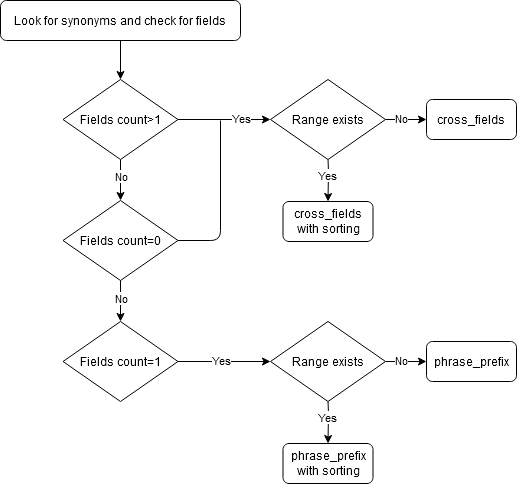

# elasticsearch-ir
Sinhala songs search application developed using Elasticsearch and Python

## Getting Started
* Run ***createindex.py*** file to create index and insert songs
* Run ***window.py*** file and it will open the GUI window
* Enter the search query in the search box

:red_circle: _Make shure the created index have writing access_

## File Structure     	
* **createindex.py** - Create index and insert songs
* **queries.py** - ElasticSeacrch multi-match queries  
* **search.py** - Search functions that process the user query
* **window.py** - Python GUI window
* **corpus** - Original data scraped from http://sinhalasongbook.com
* **final-corpus** - Translated and formatted data used to create the index   	 

## Song Data
1. Title in Sinhala and English
2. Artist Sinhala name
3. Lyricist
4. Composer
5. Views count
6. Song lyrics in Sinhala
7. Artist English name

## Functionalities
* Search can be done using any number of field like artist name, song title, etc and 

the result shows the best match
> ටී.එම්.ජයරත්න අම්මා සඳකි
* Identify synonyms related to specific fields like ගැයූ(artist), ලියූ(lyricist) and search 

within those identified fields
> අමරසිරි පීරිස් ගායනා කල ගීත
* Identify ranges given in the search query and sort by view count
> ක්ලැරන්ස් විජේවර්ධන හොඳම 10
* Artist name and song title can be searched in both Sinhala and English
> kasun kalhara ගැයූ ගී
* Identify names using a part of the full name
> sunil අහස පොළව
	 
## Multi-match Queries
* **cross_fields** - Looks for each word(token) in every field.
* **phrase_prefix** - Looks for whole query in every field.

If the query is given specifying 1 field by using synonyms like ගැයූ(artist), then the search will done in _phrase_prefix_ type. After removing synonyms, the whole query will be searched in the given field.

If the query is given specifying more than 1 field or not specifying a field, then the search will done in _cross_fields_ type. After removing synonyms, each word in the query will be searched in the given fields or every field.

Use of Multi-match queries is further described in the following diagram

